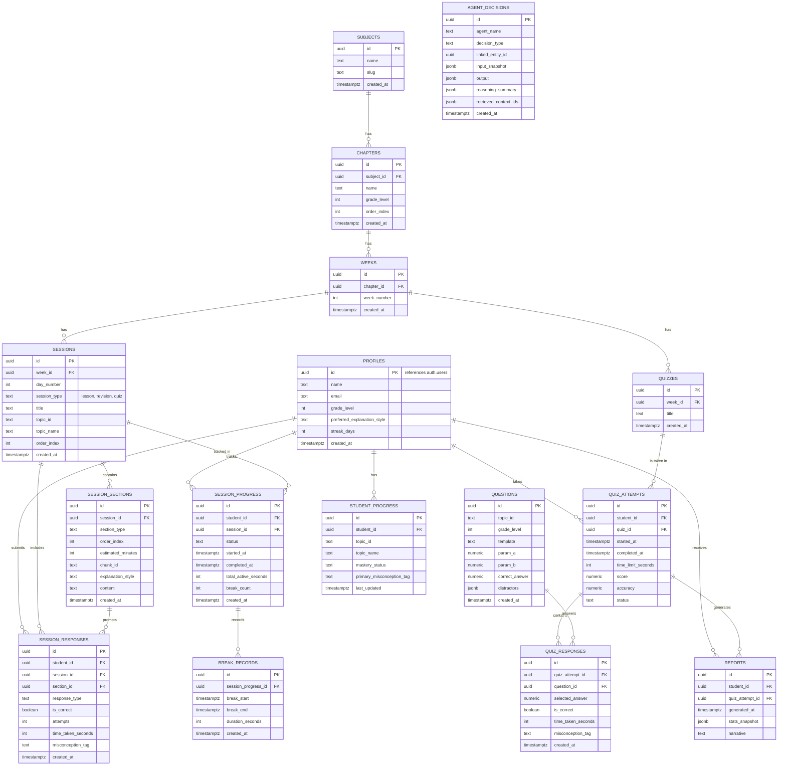

# Classroom Assistant - Database Schema

Below is the ER diagram representing the foundation schema.

```mermaid
erDiagram
    PROFILES {
        uuid id PK "references auth.users"
        text name
        text email
        int grade_level
        text preferred_explanation_style
        int streak_days
        timestamptz created_at
    }

    SUBJECTS {
        uuid id PK
        text name
        text slug
        timestamptz created_at
    }

    CHAPTERS {
        uuid id PK
        uuid subject_id FK
        text name
        int grade_level
        int order_index
        timestamptz created_at
    }

    WEEKS {
        uuid id PK
        uuid chapter_id FK
        int week_number
        timestamptz created_at
    }

    SESSIONS {
        uuid id PK
        uuid week_id FK
        int day_number
        text session_type "lesson, revision, quiz"
        text title
        text topic_id
        text topic_name
        int order_index
        timestamptz created_at
    }

    SESSION_SECTIONS {
        uuid id PK
        uuid session_id FK
        text section_type
        int order_index
        int estimated_minutes
        text chunk_id
        text explanation_style
        text content
        timestamptz created_at
    }

    SESSION_PROGRESS {
        uuid id PK
        uuid student_id FK
        uuid session_id FK
        text status
        timestamptz started_at
        timestamptz completed_at
        int total_active_seconds
        int break_count
        timestamptz created_at
    }

    BREAK_RECORDS {
        uuid id PK
        uuid session_progress_id FK
        timestamptz break_start
        timestamptz break_end
        int duration_seconds
        timestamptz created_at
    }

    SESSION_RESPONSES {
        uuid id PK
        uuid student_id FK
        uuid session_id FK
        uuid section_id FK
        text response_type
        boolean is_correct
        int attempts
        int time_taken_seconds
        text misconception_tag
        timestamptz created_at
    }

    QUESTIONS {
        uuid id PK
        text topic_id
        int grade_level
        text template
        numeric param_a
        numeric param_b
        numeric correct_answer
        jsonb distractors
        timestamptz created_at
    }

    QUIZZES {
        uuid id PK
        uuid week_id FK
        text title
        timestamptz created_at
    }

    QUIZ_ATTEMPTS {
        uuid id PK
        uuid student_id FK
        uuid quiz_id FK
        timestamptz started_at
        timestamptz completed_at
        int time_limit_seconds
        numeric score
        numeric accuracy
        text status
    }

    QUIZ_RESPONSES {
        uuid id PK
        uuid quiz_attempt_id FK
        uuid question_id FK
        numeric selected_answer
        boolean is_correct
        int time_taken_seconds
        text misconception_tag
        timestamptz created_at
    }

    STUDENT_PROGRESS {
        uuid id PK
        uuid student_id FK
        text topic_id
        text topic_name
        text mastery_status
        text primary_misconception_tag
        timestamptz last_updated
    }

    REPORTS {
        uuid id PK
        uuid student_id FK
        uuid quiz_attempt_id FK
        timestamptz generated_at
        jsonb stats_snapshot
        text narrative
    }

    AGENT_DECISIONS {
        uuid id PK
        text agent_name
        text decision_type
        uuid linked_entity_id
        jsonb input_snapshot
        jsonb output
        jsonb reasoning_summary
        jsonb retrieved_context_ids
        timestamptz created_at
    }

    %% Relationships
    SUBJECTS ||--o{ CHAPTERS : "has"
    CHAPTERS ||--o{ WEEKS : "has"
    WEEKS ||--o{ SESSIONS : "has"
    WEEKS ||--o{ QUIZZES : "has"
    
    SESSIONS ||--o{ SESSION_SECTIONS : "contains"
    
    PROFILES ||--o{ SESSION_PROGRESS : "tracks"
    SESSIONS ||--o{ SESSION_PROGRESS : "tracked in"
    
    SESSION_PROGRESS ||--o{ BREAK_RECORDS : "records"
    
    PROFILES ||--o{ SESSION_RESPONSES : "submits"
    SESSIONS ||--o{ SESSION_RESPONSES : "includes"
    SESSION_SECTIONS ||--o{ SESSION_RESPONSES : "prompts"
    
    PROFILES ||--o{ QUIZ_ATTEMPTS : "takes"
    QUIZZES ||--o{ QUIZ_ATTEMPTS : "is taken in"
    
    QUIZ_ATTEMPTS ||--o{ QUIZ_RESPONSES : "contains"
    QUESTIONS ||--o{ QUIZ_RESPONSES : "answers"
    
    PROFILES ||--o{ STUDENT_PROGRESS : "has"
    PROFILES ||--o{ REPORTS : "receives"
    QUIZ_ATTEMPTS ||--o{ REPORTS : "generates"
```
